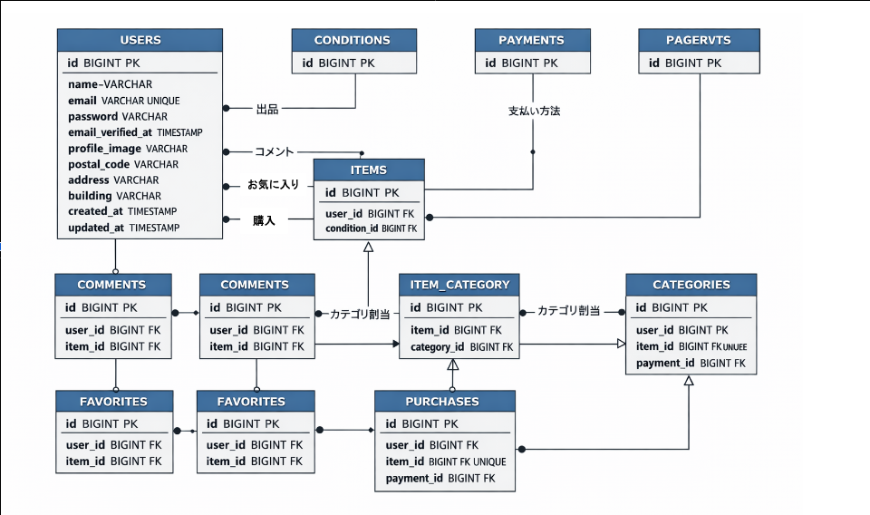

# プロジェクトの概要
    アイテムの出品と購入を行うためのフリマアプリを開発する
    
# アプリケーション名
    coachtech フリーマーケットアプリ

## 環境構築

### Docker ビルド
    ```bash
    # リポジトリをクローン
    ・git clone githttps://github.com/ryuji-inoue/fleamarket-app.git .

    # Docker コンテナをビルド・起動
    ・docker-compose up -d --build

    Laravel 環境構築
    # PHPコンテナに入る
    ・docker-compose exec php bash

    # Composerで依存関係インストール
    ・composer install

    # .envファイル作成
    ・cp .env.example .env

    # マイグレーション実行
    ・php artisan migrate

    # シーディング実行
    ・php artisan db:seed

    # ストレージシンボリックリンク作成
    ・php artisan storage:link

### envファイル設定
    ・Stripe決済とメール認証機能を実装したため、設定ファイルの修正をお願いします。
        └githubがpublic公開のため、APIキーは公開できず、アカウント周りは採点者側でご対応頂けますでしょうか。
            
    # コンフィグファイル設定
    ・ Stripe: config/services.php に以下を追加
        'stripe' => [
            'key' => env('STRIPE_KEY'),
            'secret' => env('STRIPE_SECRET'),
        ],


### 開発環境URL
    ・商品一覧画面: http://localhost/
    ・ユーザー登録: http://localhost/register
    ・phpMyAdmin: http://localhost:8080/

### 使用技術（実行環境）
    ・PHP 8.2.11
    ・Laravel 8.83.8
    ・MySQL 8.0.26
    ・Nginx 1.21.1
    ・jQuery 3.7.1.min.js

### ER図


### 使用画像
    ・ダミーデータ用: storage/app/public/items
    　　└Seederで使用する画像
    ・画面表示用: storage/app/public/images
    　　└お気に入り、コメントで使用する画像

### 設計書
    ・追記後の要件シート

### ユーザー
    ・public環境のため、お手数ですが新規登録をお願いします。

### 特記事項：コーチと相談の上、一部例外的な対応をした事項について
    # 仕様修正
        ・ロゴを押すと、商品一覧に遷移
        ・エラーメッセージ修正
        (「お名前が未入力」と表示するメッセージは、項目名がユーザー名なので、「ユーザー名が未入力」と修正)
        ・プロフィール編集時、既存画像を削除
    # テストケース
        ・No.1の5行目「全ての項目が入力されている場合、会員情報が登録され、プロフィール設定画面に遷移される」
        　メール認証機能追加後は「メール認証画面」に遷移する仕様を正しいと判断。
        ・Stripe決済のテストケースを追加
    # アカウント関係
        ・Stripe決済とメール送信は、本番環境用のアカウントを準備せず、試験環境のみで動作確認。
        (試験環境への画面遷移、laravel.logの確認と、テストユニットのパスまで。)
    # ブラウザ
        ・開発環境はWindowsなので、Safariでの確認は見送り
    # 購入機能
        ・local環境ではStripe決済をスキップする仕様としている。(商品購入処理のため)
        (コメントアウトすれば、決済画面に遷移することは確認、画面遷移を確認する場合は、お手数だがコメントアウトして頂きたい。)
    # 初期画像
        ・プロフィール画像の初期値として、デフォルト画像は設定しない方針。
    # コード以外の納品物について
        ・コーチから上記については、「採点後の質問で、認識すり合わせを行って頂きたい」と回答があった。
        　当方で、コード以外の納品物と考えているのは下記2点。docsに格納したので参照して頂きたい。
            ・システムで使用する画像
            ・追記した要件シート

    #GD認証
        ・商品登録のテストケースに失敗する場合($image = imagecreatetruecolor($width, $height)でエラー)は、
        下記コマンドで、GD拡張を有効化して下さい。

        # コンテナに入る
            ・docker compose exec php bash

        # 必要なライブラリをインストール
        apt update
        apt install -y libpng-dev libjpeg-dev libwebp-dev libfreetype6-dev

        # GD 拡張を有効化
        docker-php-ext-configure gd \
            --with-jpeg \
            --with-webp \
            --with-freetype

        docker-php-ext-install -j$(nproc) gd

        # 確認: gd が表示され、bool(true) が出ればOK
        php -m | grep gd
        php -r "var_dump(function_exists('imagecreatetruecolor'));"

